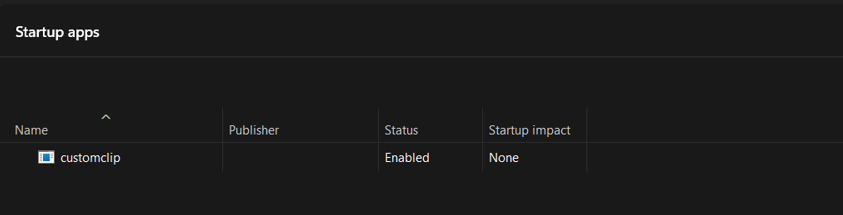
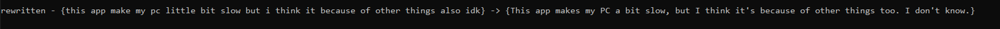
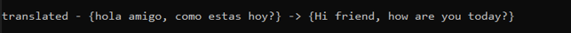
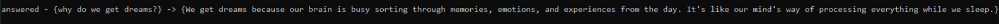
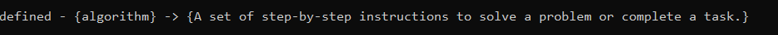

# CustomClip — Clipboard Translation & Automation Tool

CustomClip is a lightweight background tool that listens to your clipboard in real time and detects copied text, sends it to your AI model, and replaces it with an improved version.
The tool runs silently in the background, detects copied text, sends it to the API, and pastes the processed result back into your active window.

It is built for speed, simplicity, and automation—once installed, it works 24/7 without showing any window or notification.

---

## ⭐ Features

- Fixes and rewrites English instantly
- Translates text into simple English
- Answers questions in short, clear English
- Explains any word or phrase in simple English
- Works directly with clipboard text (no UI needed)
- Runs completely hidden in the background
- Can start automatically when the PC boots
- Very low CPU and memory usage
- Full source code included for transparency

---

## 🔘 Hotkeys / Usage

These hotkeys work by detecting two keys pressed together (Delete + another key). Some apps may consume navigation keys (End/Home/PageUp/PageDown), so using Delete ensures the combo is detected reliably.

| Action | Hotkey | What It Does |
|--------|--------|--------------|
| Fix / Rewrite English | `Del + End` | Cleans and rewrites clipboard text |
| Translate to English | `Del + Page Down` | Translates clipboard text into simple English |
| Answer a Question | `Del + Page Up` | Gives a short, clear answer |
| Define Word / Phrase | `Del + Home` | Explains a word or phrase in simple English |

Note: After triggering an action, keep holding Delete will block further actions until you release and press Delete again. This prevents accidental repeats.

---

## 📸 Screenshots

### CustomClip running in background (Processes)


### CustomClip enabled in Startup Apps


---

## ✨ Feature Demonstrations

### 📝 Rewrite Example


### 🌍 Translate Example


### 💬 Answer Example


### 📘 Define Example


---

## 🚀 How to Install (Simple & Quick)

### **Step 1 — Run `customclip.exe`**
Run **customclip.exe** to start the background script.

If it starts successfully, you will see it in:

**Task Manager → Processes → customclip**

(See the screenshot above.)

This confirms the tool is running and monitoring your clipboard.

---

### **Step 2 — Run `setup.exe`**
Now run **setup.exe** to register CustomClip as a startup program.

After this, CustomClip will automatically launch **every time you turn on your PC**, completely hidden.

If the setup is successful, you will see it in:

**Task Manager → Startup Apps → customclip**  
Status must be **Enabled**.

(See the screenshot above.)

---

## 🔐 Transparency — Source Code Included

If you think this looks suspicious or want to verify what happens internally, the full source code is provided.

### **1. `clip.go`**
This is the main tool written in Go.  
If you want to use your own Gemini API key, replace it on line 17:

```go
var k = " "
```

### **2. `setup.py`**
A simple script that creates the Windows startup entry for `customclip.exe`.

You may edit or run it manually if you prefer.

---

## 📁 Included Files

```py
customclip.exe → Main tool (runs hidden)
setup.exe → Adds tool to Windows Startup
clip.go → Source code (Go)
setup.py → Source code for setup
README.md → This guide
```

---

## 📝 Notes

- You do **not** need to compile anything — the provided EXE files work out of the box.  
- The tool stays **completely hidden**—no console, no popups, no taskbar icon.  
- Low resource usage ensures it never slows down your PC.  
- If you want to remove it later, simply disable/delete it from:  
  **Task Manager → Startup Apps → customclip**

---

## 🎉 Tips

- ```setup.exe``` does NOT start the tool — it only adds it to Windows startup. ```customclip.exe``` must be run once manually.
- This tool does not collect, upload, or log clipboard data. All text is processed locally except the content sent to ```Gemini API```.


## ✔ You're all set!
Once both EXEs are run, CustomClip will work automatically in the background every time your PC starts.